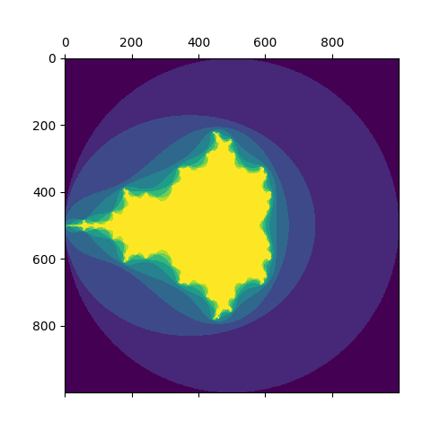

# Installation

Run the below commands (ideally in a Python virtual environment) to get the examples working.

```bash
$ pip install -r requirements.txt
...

# rust
$ maturin build -r
$ pip install target/wheels/*.whl
...

# cpp
$ c++ -O3 -Wall -shared -std=c++14 -fPIC $(python3 -m pybind11 --includes) lib.cpp -o mandelbrot_cpp$(python3 -c 'import sysconfig; print(sysconfig.get_config_var("EXT_SUFFIX"))')
...
```

# Profiling

```bash
$ python3 main.py rust
...
$ python3 main.py cpp
...
```

# Plotting

In a Python session:

```python
import numpy as np
import matplotlib.pyplot as plt

import mandelbrot_rs

result = np.array(mandelbrot_rs.generate_mandelbrot(-2, 2, -2, 2, 1000, 10)).reshape(1000, 1000)
plt.matshow(result)
plt.show()
```


